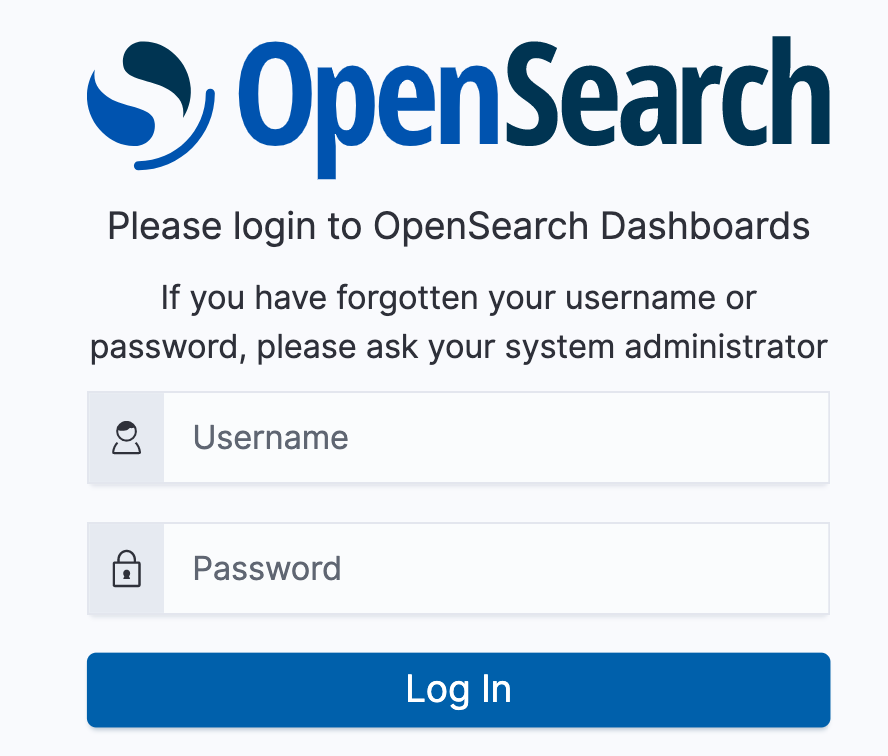
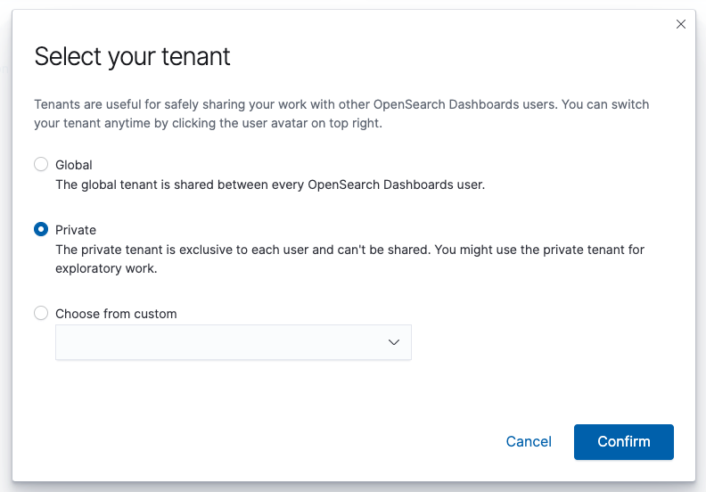
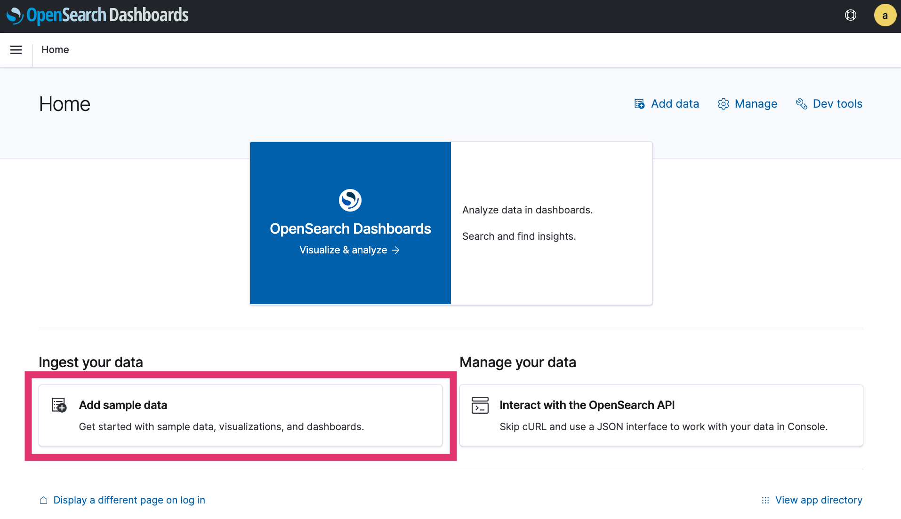
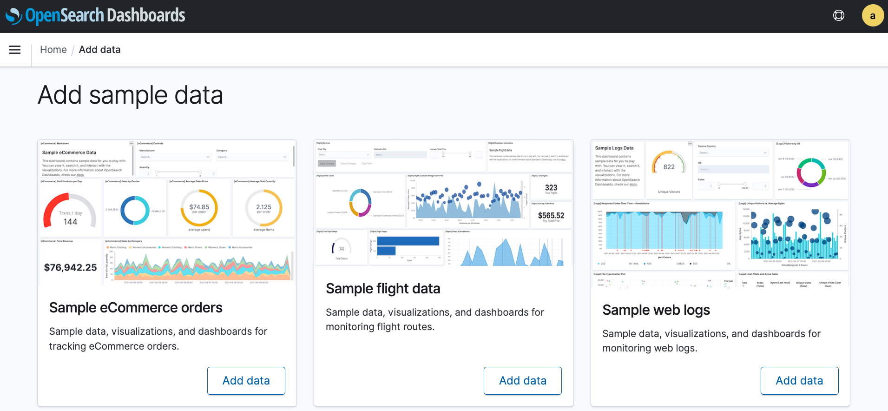
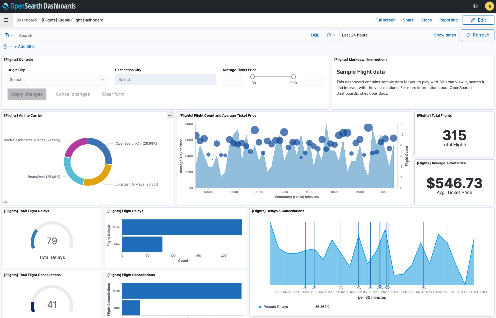
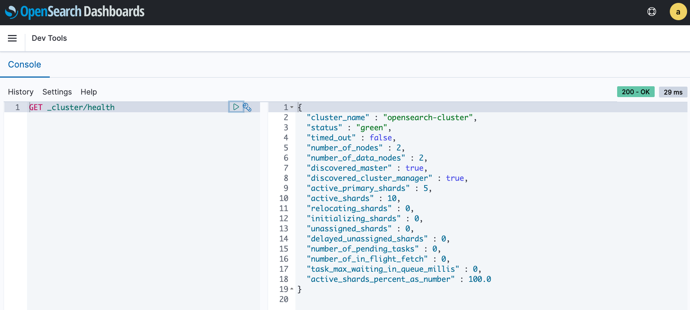

get-started-opensearch
===

Get started OpenSearch.

# Install OpenSearch as docker image

[Docker - OpenSearch documentation](https://opensearch.org/docs/2.0/opensearch/install/docker/)

## Start a cluster

```bash
docker compose up -d
```

# OpenSearch Dashboard

Access to `http://localhost:5601`.

## Login and select tenant

Enter `admin` as both *Username* and *Password* to log in.



Select **Private** for tenant.



## Add sample data



Select any sample data and **Add data**, **View Data**. (In this case, select "Sample flight data.") 



The following dashboard can be viewed.



## Execute queries from Console

You can execute any query from the Console. (In "Dev tools" - `http://localhost:5601/app/dev_tools`)

The following is an example of executing `GET _cluster/health`.

