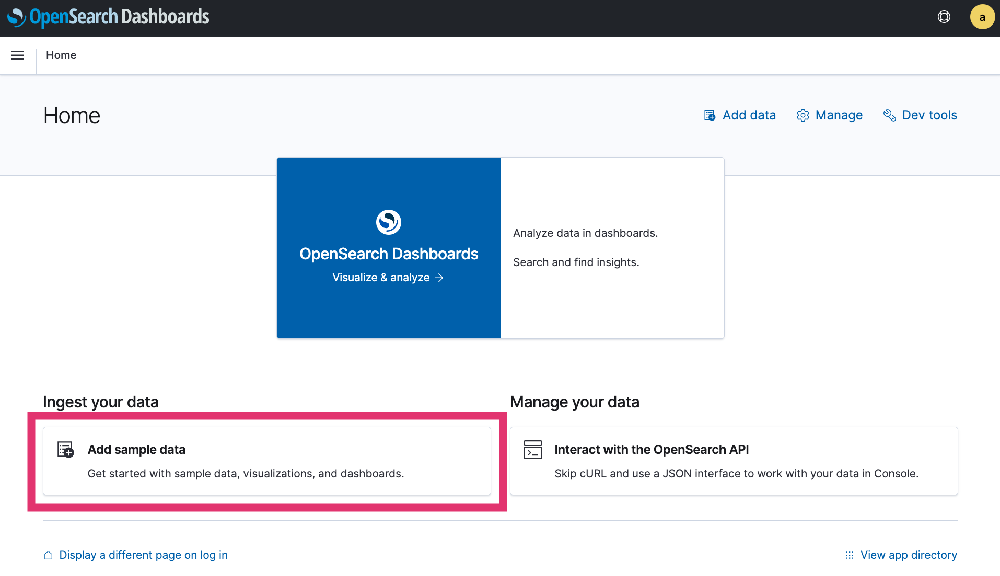
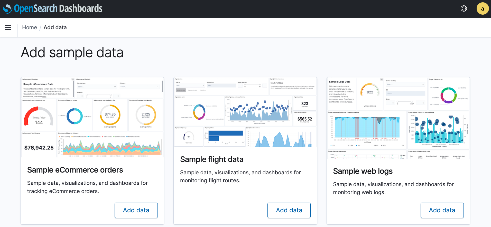
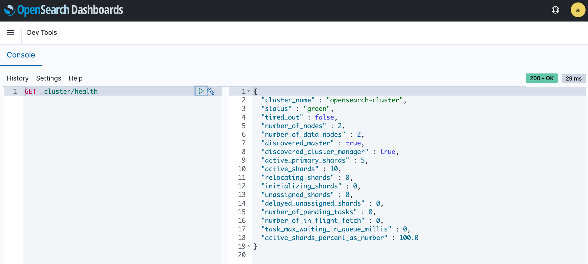

Start OpenSearch cluster as docker.
===

# Install OpenSearch as docker image

[Docker - OpenSearch documentation](https://opensearch.org/docs/2.0/opensearch/install/docker/)

## Start a cluster

```bash
docker compose up -d
```

# OpenSearch Dashboard

Access to `http://localhost:5601`.

## Login and select tenant

Enter `admin` as both *Username* and *Password* to log in.


Select **Private** for tenant.


## Add sample data



Select any sample data and **Add data**, **View Data**. (In this case, select "Sample flight data.") 



The following dashboard can be viewed.


## Execute queries from Console

You can execute any query from the Console. (In "Dev tools" - `http://localhost:5601/app/dev_tools`)

The following is an example of executing `GET _cluster/health`.



## Use OpenSearch CLI

### Install

Download from [https://opensearch.org/downloads.html](https://opensearch.org/downloads.html) and install.

```bash
> opensearch-cli --version
opensearch-cli version 1.1.0 darwin/amd64
```

### Create profile

Execute the following command to create a profile When prompted for Username and Password, enter `admin` for both.

```bash
opensearch-cli profile create \
--auth-type basic \
--endpoint https://localhost:9200 \
--name docker-local
```

### Example

Here is an example of executing a `GET _cluster/health` query and outputting the results in yaml format.

```bash
opensearch-cli curl get \
--path '_cluster/health' \
--output-format yaml \
--profile docker-local
```

If you want to omit the `--profile` option, set the environment variable `OPENSEARCH_PROFILE` to the profile name.

```bash
export OPENSEARCH_PROFILE=docker-local
```
